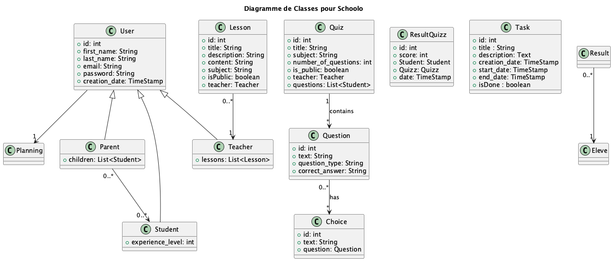

= Documentation du Projet SCHOOLO
Auteur: Votre Nom <votre.email@example.com>
:toc:
:source-highlighter: coderay

== Introduction

Ceci est la documentation générée automatiquement pour le projet SCHOOLO.

== Guide d'Installation et Configuration

Pour installer et configurer le projet, assurez-vous d'avoir Python et les dépendances listées dans requirements.txt. Voici les principales étapes d'installation :

1. Clonez le dépôt et installez les dépendances.
2. Configurez les variables d'environnement essentielles (comme `DEBUG`, `DATABASES`, etc.).

== Structure des Applications

=== Application : quizz

==== Modèles

_Aucun modèle trouvé._

==== Vues

* get_teacher_quizzes(request):
  - Pas de description disponible.
* quizz_list(request):
  - Pas de description disponible.
* quizz_detail(request):
  - Pas de description disponible.

==== Endpoints d'API

* path('api/quizzlist/', views.QuizzListView.as_view(), name='quizz-list'),
* path('api/quizzlist/<int:quizz_id>/', views.QuizzDetailView.as_view(), name='quizz-detail'),
* path('api/quizzlist/add/', views.CreateQuizzView.as_view(), name='create_quizz'),
* path('api/teacher/<int:teacher_id>/quizzes/', views.get_teacher_quizzes, name='get-teacher-quizzes'),
* path('', views.quizz_list, name='quizz_list'),
* path('<int:quizz_id>/', views.quizz_detail, name='quizz_detail'),

=== Application : activity

==== Modèles

_Aucun modèle trouvé._

==== Vues

_Aucune vue trouvée._

==== Endpoints d'API

_Aucun endpoint trouvé._

=== Application : users

==== Modèles

_Aucun modèle trouvé._

==== Vues

* list_teachers(request):
  - Pas de description disponible.
* get_teacher(request):
  - Pas de description disponible.
* get_parent(request):
  - Pas de description disponible.
* get_student(request):
  - Pas de description disponible.

==== Endpoints d'API

* path('api/teachers/', views.list_teachers, name='list-teachers'),
* path('api/register/', views.RegisterView.as_view(), name='register'),
* path('api/login/', views.LoginView.as_view(), name='login'),
* path('api/teacher/<int:id>/', views.get_teacher, name='get-teacher'),
* path('api/student/<int:id>/', views.get_student, name='get-student'),
* path('api/parent/<int:id>/', views.get_parent, name='get-parent'),

=== Application : lessons

==== Modèles

_Aucun modèle trouvé._

==== Vues

* get_teacher_lessons(request):
  - Pas de description disponible.
* subjects_list(request):
  - Pas de description disponible.
* lessons_list(request):
  - Pas de description disponible.
* lesson_detail(request):
  - Pas de description disponible.
* add_lesson(request):
  - Pas de description disponible.
* modify_lesson(request):
  - Pas de description disponible.

==== Endpoints d'API

* path('api/lessonslist/', views.LessonListView.as_view(), name='lesson-list'),
* path('api/lessonslist/subject/<str:subject>/', views.LessonListView.as_view(), name='lessons-by-subject'),
* path('api/lessonslist/detail/<int:lesson_id>/', views.LessonDetailView.as_view(), name='lesson-detail'),
* path('api/lessonslist/add', views.CreateLessonView.as_view(), name='create-lesson'),
* path('api/lessonslist/extract-pdf', views.ExtractPdfTextView.as_view(), name='extract_pdf_text'),
* path('api/teacher/<int:teacher_id>/lessons/', views.get_teacher_lessons, name='get-teacher-lessons'),
* path('', views.subjects_list, name='subjects_list'), # Liste des sujets sur l'entrée dans l'app
* path('list', views.lessons_list, name='lessons_list'),  # Liste des leçons
* path('<int:lesson_id>/', views.lesson_detail, name='lesson_detail'),  # Détail d'une leçon
* path('add/', views.add_lesson, name='add_lesson'), # ajout d'une leçon
* path('lessons/modify/<int:lesson_id>/', views.modify_lesson, name='modify_lesson'), #modifier une lecon

=== Application : stats

==== Modèles

_Aucun modèle trouvé._

==== Vues

_Aucune vue trouvée._

==== Endpoints d'API

* path('api/quizzresults/<int:quizz_id>/', views.QuizzResultsView.as_view(), name='quizz_results'),
* path('api/userQuizResults/<int:user_id>/', views.UserQuizzResultsView.as_view(), name='user_quizz_results'),

== Déploiement

Pour déployer le projet en production :

1. Configurez `DEBUG=False` et `ALLOWED_HOSTS`.
2. Utilisez `python manage.py migrate` pour appliquer les migrations.
3. Utilisez un serveur compatible WSGI, tel que Gunicorn, et configurez un proxy inverse comme Nginx pour gérer les requêtes HTTP.

== Diagrammes

Diagramme des relations de modèle :

